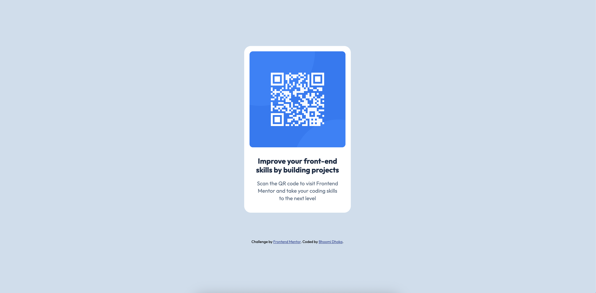

Got it! Here’s a **clean, rewritten `README.md`** specifically for **your own completed QR Code Component**, clearly describing what you built, how it works, and showing that it’s **responsive** — ready to replace the original template:

---

# 📱 Frontend Mentor - QR Code Component Solution



## 👋 Welcome!

This is my solution for the [Frontend Mentor QR Code Component Challenge](https://www.frontendmentor.io/challenges/qr-code-component-iux_sIO_H). It’s a simple and responsive QR code card built using **HTML** and **CSS** only.

---

## 📌 Overview

### The Challenge

- Build a QR code component that matches the design as closely as possible.
- Ensure it looks great on mobile and desktop screens.
- Keep the code simple, clean, and responsive.

---

## 🚀 Live Demo

👉 [View my live site here](https://qr-card-scan-me.netlify.app/)

---

## 🔧 Built With

- Semantic **HTML5**
- Modern **CSS3**
- **Flexbox** for centering
- Mobile-first approach with **responsive units**

---

## 🗂️ Folder Structure

```
/
├── index.html
├── style.css
├── images/
│ └── image-qr-code.png
├── design/
│ ├── design-preview.jpg
│ └── ...
└── README.md

```

---

## 💡 What I Learned

- How to center a card both vertically and horizontally using Flexbox.
- Using `max-width` and `padding` to make layouts responsive.
- How to match fonts, colors, and spacing from a static design.
- Using rem/em units for scalable typography.

---

## 🖥️ How to Use

1. **Clone the repo**

   ```
   bash
   git clone https://github.com/dhokabhoomi/QR-Code-Component.git
   ```


2. **Open `index.html`**

   Open the file directly in your browser or serve it with a simple local server.

---

## 🎨 Features

✅ Fully responsive layout
✅ Clean and accessible HTML structure
✅ Matches the provided Frontend Mentor design as closely as possible
✅ Uses only vanilla HTML and CSS

---

## 📦 Deployment

Deployed with **Netlify**.

---

## 📢 Author

- Frontend Mentor – [@yourusername](https://www.frontendmentor.io/profile/dhokabhoomi)
- GitHub – [@yourusername](https://github.com/dhokabhoomi)

---

## 📬 Feedback

Have suggestions or want to connect? Feel free to reach out!

---

## ✅ Status

**Challenge completed** — improving my skills in semantic HTML, responsive design, and clean CSS.

---

**Thanks for checking it out — Happy Coding! 🚀**

---
